# 开源项目健康度评估框架 (OpenLitmus)

> **Open Source Health Evaluation Framework** v1.1
> 纯静态分析框架 · 无需部署运行 · 侧重 Web 全栈应用

---

## 设计原则

1. **对抗性验证**: 不信任项目自述，一切结论需要源码或数据佐证
2. **可量化优先**: 凡能度量的不做定性判断，定性判断需标注"推断"
3. **可复现**: 所有检查步骤、工具命令、评分标准均明确定义
4. **场景敏感**: 评分需结合使用意图（调研 / PoC / 生产 / 二次开发）

---

## 评估维度总览

```mermaid
graph TB
    OpenLitmus[OpenLitmus 总分]
    OpenLitmus --> D1["① 代码规模与结构"]
    OpenLitmus --> D2["② 代码质量与安全"]
    OpenLitmus --> D3["③ 工程成熟度"]
    OpenLitmus --> D4["④ 社区与可持续性"]
    OpenLitmus --> D5["⑤ 文档与可及性"]
    OpenLitmus --> D6["⑥ 战略与生态定位"]
    
    D1 --> D1a[1.1 代码量分布]
    D1 --> D1b[1.2 文件粒度]
    D1 --> D1c[1.3 模块耦合度]
    D1 --> D1d[1.4 依赖管理]
    
    D2 --> D2a[2.1 声明-实现一致性]
    D2 --> D2b[2.2 安全基线]
    D2 --> D2c[2.3 防御性编程]
    D2 --> D2d[2.4 代码异味]
    
    D3 --> D3a[3.1 测试覆盖]
    D3 --> D3b[3.2 CI/CD]
    D3 --> D3c[3.3 版本管理]
    D3 --> D3d[3.4 数据库迁移]
    
    D4 --> D4a[4.1 贡献者分布]
    D4 --> D4b[4.2 Issue 生态]
    D4 --> D4c[4.3 开发活跃度]
    D4 --> D4d[4.4 Git 历史真实性]
    
    D5 --> D5a[5.1 入门文档]
    D5 --> D5b[5.2 架构文档]
    D5 --> D5c[5.3 API 文档]
    D5 --> D5d[5.4 国际化]
    
    D6 --> D6a[6.1 产品定位清晰度]
    D6 --> D6b[6.2 竞品差异化]
    D6 --> D6c[6.3 团队背景]
    D6 --> D6d[6.4 商业可持续性]
```



---

## 维度 ①：代码规模与结构

### 1.1 代码量分布

| 检查项 | 工具/方法 | 说明 |
|--------|----------|------|
| 按语言统计行数/文件数 | `find + wc -l` 或 `cloc` | 了解技术栈实际比重 |
| 前后端比例 | 手动计算 | 判断是否前端/后端过于失衡 |
| 注释率 | `cloc` 的注释行占比 | <5% 过低，>30% 可能注释过度 |

**评分锚点**:
| 分数 | 总行数 | 注释率 | 语言分散度 |
|------|--------|--------|------------|
| 8-10 | 5K-50K | 10-25% | ≤3 种主要语言 |
| 5-7 | 1K-5K 或 50K-150K | 5-10% 或 25-30% | 4-5 种 |
| 0-4 | <1K 或 >150K | <5% 或 >30% | >5 种或无法判定 |

### 1.2 文件粒度

| 检查项 | 工具/方法 | 红旗 🚩 |
|--------|----------|---------|
| 最大文件行数 | `find -exec wc -l + sort -rn` | 单文件 >500 行 |
| 超长函数 | AST 解析或 grep 估算 | 函数 >100 行 |
| 上帝文件 | 被导入次数最多的模块 | 单模块被 >30 处导入 |

**评分锚点**:
| 分数 | 最大文件 | 超长函数(>80行) | 上帝文件(>30处导入) |
|------|---------|-----------------|---------------------|
| 8-10 | 全部 <300行 | 0 个 | 0 个 |
| 5-7 | 最大 <800行 | ≤3 个 | ≤1 个 |
| 0-4 | 存在 >1000行 | >5 个 | >2 个 |

### 1.3 模块耦合度

| 检查项 | 工具/方法 | 说明 |
|--------|----------|------|
| 导入依赖热力图 | `grep "from app\." \| sort \| uniq -c` | 识别耦合中心 |
| 循环依赖 | `pydeps`、`madge`(JS) | 循环依赖 = 架构缺陷 |
| 层级越权 | 检查 API 层是否直接调用 DB | 违反分层架构 |

**评分锚点**:
| 分数 | 最热模块被导入数 | 循环依赖 | 层级越权 |
|------|-----------------|---------|---------|
| 8-10 | <20 处 | 0 | 无 |
| 5-7 | 20-50 处 | ≤2 处 | 少量 |
| 0-4 | >50 处 | >2 处 | 普遍 |

### 1.4 依赖管理

| 检查项 | 工具/方法 | 红旗 🚩 |
|--------|----------|---------|
| 依赖总数 | `pyproject.toml` / `package.json` | 后端 >30 / 前端 >50 需警惕 |
| 版本约束策略 | 检查 `>=` vs `~=` vs `==` | 全部 `>=` 无上限 = 不确定性炸弹 |
| 已知漏洞 | `pip-audit`、`npm audit` | 存在高危 CVE |
| 废弃依赖 | 检查 PyPI/npm 最近更新日期 | 依赖 >2 年未更新 |
| License 合规 | `pip-licenses`、`license-checker` | 存在 GPL 传染性 license |

**评分锚点**:
| 分数 | 依赖总数 | 版本锁定 | 已知高危 CVE | 废弃依赖 |
|------|---------|---------|-------------|----------|
| 8-10 | ≤20 | 有上限约束(`~=`/`==`) | 0 | 0 |
| 5-7 | 21-35 | 部分有上限 | 0 | ≤2 |
| 0-4 | >35 或全部 `>=` 无上限 | 无上限 | ≥1 | >3 |

---

## 维度 ②：代码质量与安全

### 2.1 声明-实现一致性

| 检查项 | 方法 |
|--------|------|
| README 功能声明 | 逐条列出 |
| 源码验证 | 对每条声明找到对应实现代码 |
| 偏差记录 | 标注"属实 / 夸大 / 未实现 / 未提及但存在" |

**核心提问**: "README 说了什么？代码做到了几成？有什么代码里有但 README 没说的？"

**评分锚点**:
| 分数 | 声明属实率 | 未提及的隐藏功能/问题 |
|------|-----------|---------------------|
| 8-10 | >90% 声明可在源码中验证 | 未提及项为正面功能 |
| 5-7 | 70-90% 属实 | 存在少量未提及的问题 |
| 0-4 | <70% 属实或存在重大夸大 | 存在严重未披露的问题 |

### 2.2 安全基线

| 检查项 | 预期 | 严重度 |
|--------|------|--------|
| 密钥管理 | 无硬编码默认密钥；使用 env var | 🔴 严重 |
| 认证/授权 | JWT/Session + RBAC 完整实现 | 🔴 严重 |
| 输入验证 | 全部用 schema 接收，无 raw dict | 🟡 中等 |
| 速率限制 | 认证端点有频次控制 | 🟡 中等 |
| CORS 配置 | 非 `*`，限定来源 | 🟡 中等 |
| CSRF 保护 | 对状态变更操作有保护 | 🟡 中等 |
| SSRF 防护 | 出站 HTTP 请求验证 URL | 🟡 中等 |
| SQL 注入 | 使用参数化查询 / ORM | 🔴 严重 |
| SECURITY.md | 存在安全漏洞披露流程 | 🟢 低 |

**评分锚点**: 逐项检查，每通过 1 项得 1 分（9 项满分 9，按比例换算到 10 分制）。🔴 项未通过额外扣 1 分（可为负分，最低 0 分）。

### 2.3 防御性编程

| 检查项 | 方法 |
|--------|------|
| 错误处理模式 | 搜索 `except Exception`、bare `except` |
| 超时配置 | 外部 HTTP 调用是否有 timeout |
| 资源泄漏 | async 资源是否正确关闭 (context manager) |
| 幂等性 | 关键操作（seed、migrate）是否幂等 |

**评分锚点**:
| 分数 | bare except | 外部调用超时 | 资源管理 |
|------|-----------|-------------|---------|
| 8-10 | 0 处 | 全部有 timeout | 全部用 context manager |
| 5-7 | ≤3 处 | 大部分有 | 大部分正确 |
| 0-4 | >5 处 | 普遍缺失 | 明显泄漏风险 |

### 2.4 代码异味

| 异味类型 | 检测方法 | 红旗 🚩 |
|---------|---------|---------|
| 上帝函数 | 函数 >80行 | 存在 >200行的函数 |
| 上帝文件 | 文件 >500行 | 存在 >1000行的文件 |
| 内联导入 | 函数内部 `from x import y` | 大量存在说明架构问题 |
| 硬编码 | grep 魔法数字/字符串 | 配置未外部化 |
| Dead code | 注释掉的代码块 | 大量存在 |

**评分锚点**:
| 分数 | 上帝文件(>1000行) | 内联导入 | 硬编码配置 |
|------|-------------------|---------|-----------|
| 8-10 | 0 个 | 偶尔（循环依赖规避） | 全部外部化 |
| 5-7 | ≤2 个 | 散见 | 少量 |
| 0-4 | >3 个 | 普遍 | 大量 |

---

## 维度 ③：工程成熟度

### 3.1 测试覆盖

| 检查项 | 方法 |
|--------|------|
| 测试文件存在性 | `find -name 'test_*'` |
| 测试框架配置 | 检查 pytest/jest 配置 |
| 测试覆盖率 | `coverage report` |
| 关键路径测试 | 认证/数据库/核心业务有无对应测试 |

**评分锚点**:
| 分数 | 测试文件 | 覆盖率 | 关键路径覆盖 |
|------|---------|--------|-------------|
| 8-10 | 有组织的 test 目录 | >70% | 认证+核心业务均有测试 |
| 5-7 | 有测试文件 | 30-70% | 部分关键路径有测试 |
| 2-4 | 仅有框架配置无实际测试 | <30% | 无 |
| 0-1 | 完全不存在 | 0% | 无 |

### 3.2 CI/CD

| 检查项 | 方法 |
|--------|------|
| CI 配置文件 | `.github/workflows/`、`.gitlab-ci.yml` |
| 自动化检查 | lint + test + build |
| 分支保护 | main 是否需要 PR 审核 |

**评分锚点**: 无 CI = 0分；仅 lint = 3分；lint + test = 6分；lint + test + build + 分支保护 = 10分。

### 3.3 版本管理

| 检查项 | 方法 |
|--------|------|
| 语义化版本 | 检查 tag 命名 |
| Changelog | CHANGELOG.md / Release Notes |
| Breaking Change 标注 | Release Notes 中的警告 |

**评分锚点**:
| 分数 | 版本号规范 | Changelog | Breaking Change 标注 |
|------|-----------|----------|---------------------|
| 8-10 | 严格 SemVer + 完整 tag | 每版本详细 changelog | 有明确 ⚠️ 标注 |
| 5-7 | 基本遵循 SemVer | 有 Release Notes | 无标注但有说明 |
| 0-4 | 无规范或 tag 不全 | 无 | 无 |

### 3.4 数据库迁移

| 检查项 | 方法 | 红旗 🚩 |
|--------|------|---------|
| 迁移工具 | Alembic / Flyway / Prisma | 无迁移工具 = 严重 |
| 迁移一致性 | `create_all` 与 migration 并存 | 并行使用 = 风险 |
| 数据迁移脚本 | 是否有数据迁移 | 只有 schema 迁移无数据迁移 |

**评分锚点**:
| 分数 | 迁移工具 | 一致性 | 数据迁移 |
|------|---------|--------|---------|
| 8-10 | 有且是唯一的 schema 管理方式 | 无冲突 | 有 |
| 5-7 | 有但与 create_all 并存 | 有潜在冲突 | 无 |
| 0-4 | 无迁移工具 | — | — |

---

## 维度 ④：社区与可持续性

### 4.1 贡献者分布 (Bus Factor)

| 检查项 | 工具 |
|--------|------|
| 总贡献者数 | `git shortlog -sn` |
| 头号贡献者占比 | commit 占比 |
| 核心文件贡献者数 | `git log --format='%an' -- <file>` |
| 外部贡献者 | 排除 org 成员后的贡献者 |

**评分锚点**:
| 分数 | 总贡献者 | 头号占比 | 外部贡献者 |
|------|---------|---------|------------|
| 8-10 | ≥10 | <50% | ≥5 |
| 5-7 | 5-9 | 50-70% | 2-4 |
| 2-4 | 3-4 | 70-90% | 1 |
| 0-1 | ≤2 | >90% | 0 |

### 4.2 Issue 生态

| 检查项 | 方法 | 说明 |
|--------|------|------|
| Issue 总数与关闭率 | GitHub API / 页面 | 关闭率 <50% = 响应不足 |
| 平均首次响应时间 | 抽样检查 | >7天 = 社区冷淡 |
| Issue 提交者分布 | 是否为真实用户 | Bot/团队自提 = 虚假繁荣 |
| 有无未回复的求助 | 手动浏览 | 存在 = 社区支持不到位 |

**评分锚点**:
| 分数 | 关闭率 | 首次响应 | 真实用户 Issue 占比 |
|------|--------|---------|-------------------|
| 8-10 | >80% | <48h | >70% |
| 5-7 | 50-80% | 2-7天 | 40-70% |
| 0-4 | <50% | >7天或无响应 | <40% 或大量 bot 自提 |

### 4.3 开发活跃度

| 检查项 | 工具 | 红旗 🚩 |
|--------|------|---------|
| commit 频率趋势 | `git log --format='%ai'` 按周统计 | 断崖式下降 |
| 最近一次 commit | `git log -1` | >3个月前 = 可能已放弃 |
| 迭代节奏 | Release 间隔 | >6个月无 release = 停滞 |

**评分锚点**:
| 分数 | 最近 commit | Release 间隔 | 趋势 |
|------|-----------|-------------|------|
| 8-10 | <1 周 | <2 月 | 稳定或增长 |
| 5-7 | 1周-1月 | 2-6月 | 平稳 |
| 0-4 | >3月 | >6月或无 | 下降或停滞 |

### 4.4 Git 历史真实性 ⚡

> [!CAUTION]
> 这是常被忽略但极其重要的维度。

| 检查项 | 方法 | 说明 |
|--------|------|------|
| 首次 commit 日期 | `git log --reverse` | 远晚于声称的版本历史 = 重置过历史 |
| commit 日期分布 | 按天/周统计 | 大量 commit 集中在几天 = squash 推送 |
| Tag 覆盖度 | `git tag -l` vs Release 声明 | 仅有最新 tag = 历史版本不在公开 git 中 |
| 有无 force push 痕迹 | PR 历史/Reflog | 重写历史 = 需要质疑"迭代节奏"声明 |

**评分锚点**:
| 分数 | 历史跨度 | commit 分布 | Tag 覆盖 |
|------|---------|-----------|---------|
| 8-10 | >6 月持续公开开发 | 均匀分布 | 所有声称版本均有 tag |
| 5-7 | 1-6 月 | 基本均匀 | 大部分版本有 tag |
| 0-4 | <1 月或一次性推送 | 极度集中 | 仅最新版本有 tag |

**为什么重要**: 一个声称"已迭代 8 个版本"的项目，如果 git 历史只有 5 天，说明之前都是私有开发。这意味着：
- 社区参与在整个历史中几乎不存在
- 代码审查标准无法从公开历史判断
- "快速迭代"可能只是内部开发的一次性公开

---

## 维度 ⑤：文档与可及性

> **计分方式**: 条件清单计分法（共 12 项检查，每满足 1 项得 0.83 分，四舍五入）。

### 5.1 入门文档

| 检查项 | 方法 |
|--------|------|
| README 完整度 | 是否包含安装/运行/配置步骤 |
| 一键运行 | setup.sh / docker-compose |
| 环境要求说明 | 明确列出版本要求 |

### 5.2 架构文档

| 检查项 | 方法 |
|--------|------|
| 架构图 | README / docs/ |
| 设计决策记录 (ADR) | docs/adr/ |
| 模块说明 | 每个目录/模块有 README |

### 5.3 API 文档

| 检查项 | 方法 |
|--------|------|
| OpenAPI / Swagger | FastAPI 自动生成 /docs |
| API 使用示例 | docs/ 或 README |
| 错误码说明 | 统一错误响应格式 |

### 5.4 国际化与可及性

| 检查项 | 方法 |
|--------|------|
| 多语言文档 | README_zh-CN.md 等 |
| i18n 框架 | react-i18next 等 |
| 贡献者友好 | CONTRIBUTING.md + issue template |

**维度⑤ 条件清单**:
- [ ] README 包含安装步骤
- [ ] README 包含运行步骤
- [ ] README 包含配置说明
- [ ] 存在一键运行脚本（setup.sh / docker-compose）
- [ ] 明确列出环境版本要求
- [ ] 有架构图
- [ ] 有 ADR 或设计决策文档
- [ ] 有 API 文档（OpenAPI 或等效）
- [ ] 有 API 使用示例
- [ ] 有多语言文档
- [ ] 有 i18n 框架
- [ ] 有 CONTRIBUTING.md + issue template

---

## 维度 ⑥：战略与生态定位

> **计分方式**: 条件清单计分法（每子维度 3 条，满足 N 条 = N×3.3 分，四舍五入）。

### 6.1 产品定位清晰度

| 检查项 | 方法 |
|--------|------|
| 一句话定位 | README 首段是否清晰传达价值 |
| 核心用户画像 | 文档中是否明确目标用户 |
| 边界说明 | 项目不做什么（anti-goals） |

**条件清单**:
- [ ] README 首段能在一句话内传达核心价值
- [ ] 文档/官网中有明确的目标用户描述
- [ ] 存在 anti-goals 或 non-goals 说明

### 6.2 竞品差异化

| 检查项 | 方法 |
|--------|------|
| 同赛道项目列举 | 手动调研 |
| 独特卖点 (USP) | 有什么是竞品做不到的 |
| USP 源码验证 | 声称的差异化在代码中是否真实实现 |

**USP 验证三步法**:
1. 列出项目声称的独特卖点（从 README/官网提取）
2. 搜索 2-3 个主要竞品，检查是否有等价实现
3. 对确认为独特的 USP，在源码中验证实现深度（玩具级 / 可用级 / 生产级）

**条件清单**:
- [ ] 能列出 ≥1 个竞品确实没有的功能
- [ ] 该功能在源码中有实质性实现（非空壳）
- [ ] 该功能解决了真实的用户痛点（Issue/文档中有证据）

### 6.3 团队背景

| 检查项 | 方法 |
|--------|------|
| 组织/个人历史项目 | GitHub org 页面 |
| 核心成员背景 | LinkedIn / 公开信息 |
| 关联项目关系 | 同一组织的其他仓库 |

**条件清单**:
- [ ] 团队/个人有成功的历史开源项目（>1K Stars）
- [ ] 核心贡献者有可验证的专业背景
- [ ] 项目属于一个有多个活跃仓库的组织（非孤立项目）

### 6.4 商业可持续性

| 检查项 | 方法 |
|--------|------|
| License 类型 | Apache 2.0 / MIT / GPL |
| SaaS / 付费版暗示 | 官网、配置中的 enterprise 字段 |
| 资金来源 | 融资新闻、sponsors |

**条件清单**:
- [ ] 使用宽松 License（Apache 2.0 / MIT）
- [ ] 有可见的商业化路径（SaaS/企业版/咨询服务）
- [ ] 有资金支持（融资、基金会赞助、企业背书）

---

## 评分计算

### 加权公式

```
总分 = Σ (维度得分 × 维度权重)
```

| 维度 | 调研权重 | PoC 权重 | 生产权重 | 二次开发权重 |
|------|---------|---------|---------|-------------|
| ① 代码规模与结构 | 0.10 | 0.10 | 0.15 | 0.20 |
| ② 代码质量与安全 | 0.10 | 0.15 | 0.25 | 0.25 |
| ③ 工程成熟度 | 0.05 | 0.15 | 0.25 | 0.20 |
| ④ 社区与可持续性 | 0.20 | 0.20 | 0.15 | 0.15 |
| ⑤ 文档与可及性 | 0.25 | 0.20 | 0.10 | 0.10 |
| ⑥ 战略与生态定位 | 0.30 | 0.20 | 0.10 | 0.10 |

**权重推导依据**:
- **调研**: 首要关注"这个项目解决什么问题、是否有独特价值"（⑥），其次看"能否快速上手评估"（⑤），代码细节权重最低
- **PoC**: 六个维度接近均衡分布，因为 PoC 对所有方面都有基本要求
- **生产**: 安全和工程成熟度决定能否可靠运行（②③各占 0.25），战略和文档退居次要
- **二次开发**: 代码结构和质量直接决定改造成本（①②各占 0.20-0.25），社区和文档辅助判断维护难度

### 等级划分

| 等级 | 分数范围 | 含义 |
|------|---------|------|
| 🟢 A | 8.0-10.0 | 生产级就绪，可大规模采用 |
| 🔵 B | 6.0-7.9 | 可用于 PoC/小规模生产，需补强 |
| 🟡 C | 4.0-5.9 | 有价值但风险显著，仅建议调研 |
| 🔴 D | 2.0-3.9 | 高风险，不建议直接使用 |
| ⚫ F | 0-1.9 | 放弃 |

---

## 数据采集工具链

```bash
# ===== 克隆 =====
git clone --depth 100 <repo-url> _eval_tmp && cd _eval_tmp

# ===== 1. 代码规模 =====
# 行数/文件数统计
find . -type f \( -name '*.py' -o -name '*.ts' -o -name '*.tsx' -o -name '*.go' \) \
  ! -path '*/node_modules/*' ! -path '*/.git/*' | xargs wc -l | tail -1

# 最大文件
find . -type f \( -name '*.py' -o -name '*.tsx' \) ! -path '*/node_modules/*' \
  -exec wc -l {} + | sort -rn | head -15

# 导入依赖热力图（Python）
grep -rh "^from <pkg>\." <src-dir>/ --include='*.py' | sed 's/import.*//' | sort | uniq -c | sort -rn

# ===== 2. Git 历史 =====
# 贡献者分布
git shortlog -sn --all

# 每日 commit 数
git log --format='%ai' | awk '{print $1}' | sort | uniq -c

# 首次与最新 commit
git log --reverse --oneline | head -1
git log --oneline -1

# Bus Factor（逐文件）
git log --format='%an' -- <critical-file> | sort -u | wc -l

# ===== 3. 工程成熟度 =====
# 测试文件
find . -type f \( -name 'test_*' -o -name '*.test.*' -o -name '*.spec.*' \) \
  ! -path '*/node_modules/*'

# CI/CD 配置
find .github .gitlab-ci* .circleci Jenkinsfile -type f 2>/dev/null

# 安全文件
ls -la SECURITY* .snyk*

# ===== 4. 依赖审计  =====
# Python
pip-audit -r requirements.txt  # 或 pip-audit (在 venv 中)
pip-licenses --format=table

# Node.js
npm audit
npx license-checker --summary
```

---

## 使用指南

### Step 1: 确定评估场景

先明确你的意图（调研 / PoC / 生产 / 二次开发），这决定了权重分配。

### Step 2: 数据采集

按顺序运行上述工具链，记录原始数据。

### Step 3: 逐维度评分

对照每个检查项和评分锚点，给出 0-10 分。标注每个分数的**证据来源**（具体文件、命令输出、URL）。

### Step 4: 加权汇总

代入权重公式计算总分和等级。

### Step 5: 撰写报告

按以下结构输出最终报告：
1. 项目概况（一段话）
2. 关键事实数据（定量指标汇总表）
3. 逐维度评分（每个维度的核心结论 + 证据引用）
4. 红旗清单（所有 🚩 项集中列出，含严重度和维度归属）
5. 加权评分表（四场景分别计算）
6. 使用建议（针对具体场景的 ✅/⚠️/❌ 判断）

> **实例参考**: 可参照本框架配套的 Clawith 评估报告作为报告模板。
